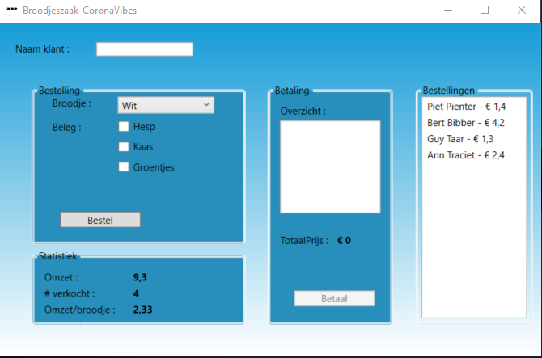

# Voorbeeldexamen PRB

Dit examen laat je de aangeleerde kennis toepassen voor een eenvoudige broodjeszaak.

# Pre-Work

* Voorzie alle controls van een duidelijke naam.
* Lees de opdracht grondig en denk al even na hoe je deze opdracht zal aanpakken

# Werking

## Startsituatie

Bij het laden van de applicatie wordt de *ComboBox* gevuld met de beschikbare broodTypes. Het eerste broodType wordt geselecteerd.
Enkel de knop 'Bestel' is beschikbaar voor de gebruiker.

### Functionaliteiten: uitwerking

## Bestelling

### Ingave bestelling

Bij de ingave van de bestelling wordt de klantnaam ingegeven, het gewenst BroodType geselecteerd en het beleg geselecteerd.

#### Functionaliteit uitwerking

### Verwerking bestelling

* Na de ingave wordt op de knop 'Bestel' geklikt, zodat de gegevens in het besteloverzicht komen en de prijs wordt bepaald. Het detail van de bestelling komt in het 'Overzicht' terecht en zowel de ingave van de naam als het venster 'Bestelling' worden gereset. Er kan afgerekend worden.
* Voorzie de nodige foutmelding, wanneer de klantnaam niet wordt ingegeven!

#### Functionaliteit uitwerking

### Afrekenen bestelling

Na de afrekening kan de uitbater de knop 'Betaal' aanklikken, daardoor

* wordt de bestelling in de statistieken verwerkt
* wordt de bestellingenlijst wordt
* kan er opnieuw besteld worden

Na de betaling wordt er enkele zaken berekend: de totaalprijs van de verkochte broodjes (actuele omzet) en de gemiddelde omzet per broodje. 

In 'Statistiek' wordt:

* het aantal verkochte broodjes aangepast
* De omzet/broodje wordt berekend en weergegeven

#### Functionaliteit uitwerking

### Overzicht na 4 ingaves

Op het einde van de dag kan de uitbater zijn verkopen zien.

Hieronder een afbeelding die dit weergeeft, na ingeven van 4 betalingen.

#### Functionaliteit uitwerking

# Prijzen

Brooddeel | Prijs
--------- | -----
Wit Broodje | € 0,5
Grijs Broodje | € 0,6
Volkoren Broodje | € 0,7
Hesp | € 1
Kaas | € 0,7
Groentjes | € 2
Geen beleg | € 1

# Demo

#### Functionaliteit uitwerking
 

# Mogelijke extra's

* Voorzie een knop 'Verrassingsbroodje' die een broodje maakt van een willekeurige broodsoort
* Voorzie enkele extra belegmogelijkheden
* Voorzie de nodige logica om een bestelling te verwijderen uit de lijst 'Bestellingen'
* Pas de statistieken aan na de toepassing van de bovenstaande mogelijkheden
